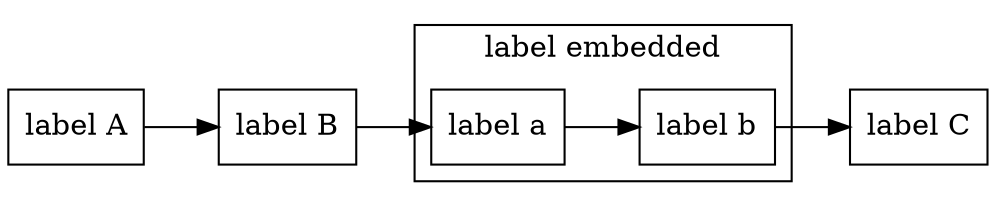
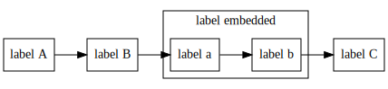

#Why use Graphs?

In this simple example we can declare a graph with some custom vertex classes:

```java
Named a = Named.of("A");
Named b = Named.of("B");
Named c = Named.of("C");

Named embeddedA = Named.of("a");
Named embeddedB = Named.of("b");
```

It is possible to create subgraphs:

```java
Embedded embedded = Embedded.builder()
  .name("embedded")
  .graph(GraphBuilder.<Base>withDirectedGraph()
    .addEdgeChain(embeddedA, embeddedB)
    .build())
  .putConnections(b, embeddedA)
  .putConnections(c, embeddedB)
  .build();
```

Create a graph with all connections:

```java
DefaultDirectedGraph<Base, DefaultEdge> graph = GraphBuilder.<Base>withDirectedGraph()
  .addEdgeChain(a, b, embedded, c)
  .build();
```

Create a dot file from this graph:

```java
String dotFile = GraphAsDot.builder(Base::name)
  .subGraphIdSeparator("__")
  .label("label")
  .nodeAsLabel(vertex -> "label " + vertex.name())
  .nodeAttributes(vertex -> asMap("shape", "rectangle"))
  .sortedBy((GraphAsDot.AsComparable<Base, String>) Base::name)
  .subGraph(vertex -> vertex instanceof Embedded
    ? Optional.of(((Embedded) vertex).subGraph())
    : Optional.empty())
  .build()
  .asDot(graph);
```



which looks like this:

