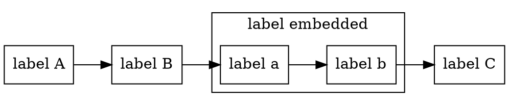
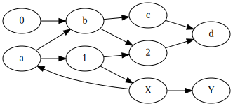
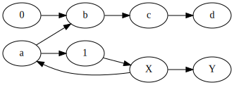
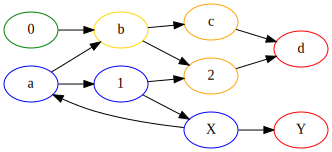
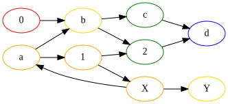

#Why use Graphs?

In this simple example we can declare a graph with some custom vertex classes:

```java
Named a = Named.of("A");
Named b = Named.of("B");
Named c = Named.of("C");

Named embeddedA = Named.of("a");
Named embeddedB = Named.of("b");
```

It is possible to create subgraphs:

```java
Embedded embedded = Embedded.builder()
  .name("embedded")
  .graph(GraphBuilder.<Base>withDirectedGraph()
    .addEdgeChain(embeddedA, embeddedB)
    .build())
  .putConnections(b, embeddedA)
  .putConnections(c, embeddedB)
  .build();
```

Create a graph with all connections:

```java
DefaultDirectedGraph<Base, DefaultEdge> graph = GraphBuilder.<Base>withDirectedGraph()
  .addEdgeChain(a, b, embedded, c)
  .build();
```

Create a dot file from this graph:

```java
String dotFile = GraphAsDot.builder(Base::name)
  .subGraphIdSeparator("__")
  .label("label")
  .nodeAsLabel(vertex -> "label " + vertex.name())
  .nodeAttributes(vertex -> asMap("shape", "rectangle"))
  .sortedBy(Base::name)
  .subGraph(vertex -> vertex instanceof Embedded
    ? Optional.of(((Embedded) vertex).subGraph())
    : Optional.empty())
  .build()
  .asDot(graph);
```



which looks like this:


                         
## Walk the Graph

Given a sample graph


                                       
you can filter the graph:

```java
DefaultDirectedGraph<String, DefaultEdge> graph = sample();

DefaultDirectedGraph<String, DefaultEdge> filtered = Graphs.filter(graph, it -> !it.equals("2"));
```



you can traverse the graph starting with leaves:

```java
DefaultDirectedGraph<String, DefaultEdge> graph = sample();
List<VerticesAndEdges<String, DefaultEdge>> leaves = Graphs.leavesOf(graph);

assertThat(leaves).hasSize(5);

VerticesAndEdgesAssert.assertThat(leaves.get(0))
  .containsVertices("d", "Y")
  .containsEdges("c->d", "2->d", "X->Y")
  .hasLoops(0);

VerticesAndEdgesAssert.assertThat(leaves.get(1))
  .containsVertices("c", "2")
  .containsEdges("b->c", "1->2", "b->2")
  .hasLoops(0);

VerticesAndEdgesAssert.assertThat(leaves.get(2))
  .containsVertices("b")
  .containsEdges("a->b", "0->b")
  .hasLoops(0);

VerticesAndEdgesAssert.assertThat(leaves.get(3))
  .containsVertices("0")
  .containsEdges()
  .hasLoops(0);

VerticesAndEdgesAssert.assertThat(leaves.get(4))
  .containsVertices("a", "1", "X")
  .containsEdges()
  .hasLoops(1)
  .containsLoop("1->X", "X->a","a->1");
```



or the roots:

```java
DefaultDirectedGraph<String, DefaultEdge> graph = sample();
List<VerticesAndEdges<String, DefaultEdge>> roots = Graphs.rootsOf(graph);

assertThat(roots).hasSize(5);

VerticesAndEdgesAssert.assertThat(roots.get(0))
  .containsVertices("0")
  .containsEdges("0->b")
  .hasLoops(0);

VerticesAndEdgesAssert.assertThat(roots.get(1))
  .containsVertices("a", "1", "X")
  .containsEdges()
  .hasLoops(1)
  .containsLoop("1->X", "X->a","a->1");

VerticesAndEdgesAssert.assertThat(roots.get(2))
  .containsVertices("b", "Y")
  .containsEdges("b->c", "b->2")
  .hasLoops(0);

VerticesAndEdgesAssert.assertThat(roots.get(3))
  .containsVertices("c", "2")
  .containsEdges("c->d", "2->d")
  .hasLoops(0);

VerticesAndEdgesAssert.assertThat(roots.get(4))
  .containsVertices("d")
  .containsEdges()
  .hasLoops(0);

```


